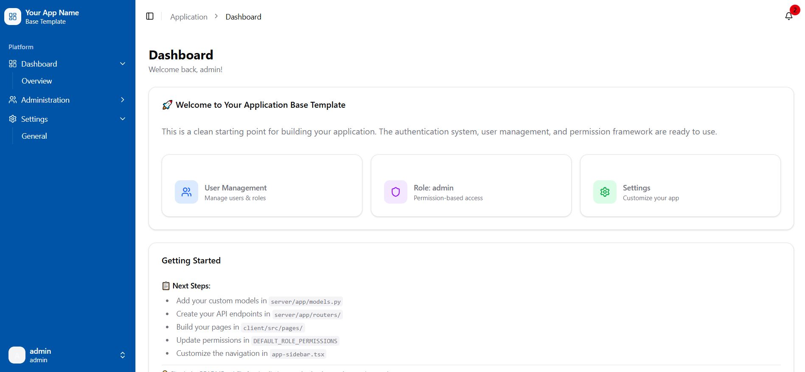

# Templates

A collection of reusable templates and boilerplate code for building applications.

## Available Templates

### [monolithic-application-base](./monolithic-application-base/README.md)

Full-stack monolithic app with a React (Vite + TypeScript) frontend and Python (FastAPI) backend. Includes authentication, user management, role-based permissions, and a component library based on shadecn ui.

## Overview

Each template is self-contained in its own directory with its own `README.md` covering setup, configuration, and usage instructions.

## Contributing

When adding a new template, create a dedicated folder and include a `README.md` that describes the stack, features, and how to get started.
